# ARQUITECTURA DEL PROJECTE TEXTAMI

**Data:** 24 Agost 2025  
**Versió:** 0.1.0-ai-first  
**Status:** Fase 1 - Intel·ligència Artificial en Desenvolupament

---

## 🎯 VISIÓ ARQUITECTÒNICA

Textami utilitza una **arquitectura AI-first** amb un enfocament modular que evita el deute tècnic posposant la decisió del motor de generació final fins tenir tota la informació necessària.

## 🏗️ ESTRATÈGIA DE DESENVOLUPAMENT

### **Principi Fonamental:**
**AI-First, Docxtemplater-Last** - Desenvolupar tota la intel·ligència artificial i interfície abans de decidir el motor de generació de documents final.

### **Arquitectura de 4 Fases:**

```mermaid
graph LR
    A[Fase 1: IA] --> B[Fase 2: UI]
    B --> C[Fase 3: Backend]
    C --> D[Fase 4: DECISIÓ]
    D -->|Opció A| E[Docxtemplater Std]
    D -->|Opció B| F[Docxtemplater Premium]
    D -->|Opció C| G[Alternatives]
```



#### **Fase 1: Intel·ligència Artificial (ACTUAL)**
```typescript
// Capa d'IA completament independent
interface AIServices {
  documentAnalysis: DocumentAnalysisService
  placeholderDetection: PlaceholderDetectionService  
  intelligentMapping: MappingService
  contentValidation: ValidationService
}
```

#### **Fase 2: Interfície d'Usuari (SEGÜENT)**  
```typescript
// UI agnòstica al motor de generació
interface UILayer {
  layout: ThreePanelLayout
  workflow: WorkflowManager
  preview: MockDocumentPreview  // Mockejada fins decidir motor
}
```

#### **Fase 3: Backend Agnòstic (DESPRÉS UI)**
```typescript
// Factory pattern per intercanviabilitat
interface DocumentGenerator {
  initialize(config: GeneratorConfig): Promise<void>
  generateDocument(template: Buffer, data: any): Promise<Buffer>
  supportedFeatures(): Feature[]
}
```

#### **Fase 4: DECISIÓ + Motor Específic (FINAL)**
- Avaluar opcions amb context complet
- Implementar motor escollit 
- Zero refactoring de fases anteriors

---

## 🔧 STACK TECNOLÒGIC ACTUAL

### **Frontend:**
```json
{
  "framework": "Next.js 15.4.6",
  "runtime": "React 19.1.0", 
  "language": "TypeScript 5.0",
  "styling": "Tailwind CSS 4.0",
  "state": "Zustand (planned)",
  "animations": "Framer Motion (planned)"
}
```

### **Backend:**
```json
{
  "runtime": "Node.js + Next.js API Routes",
  "database": "Supabase PostgreSQL",
  "storage": "Supabase Storage", 
  "auth": "Supabase Auth",
  "ai": "OpenAI GPT-5 Vision API"
}
```

### **Infrastructure:**
```json
{
  "hosting": "Vercel",
  "domain": "TBD",
  "monitoring": "Vercel Analytics",
  "errors": "Built-in Next.js error handling"
}
```

---

## 📊 ARQUITECTURA DE DADES

### **Database Schema (Supabase):**

```sql
-- Templates and AI Analysis
CREATE TABLE templates (
  id UUID PRIMARY KEY DEFAULT gen_random_uuid(),
  user_id UUID REFERENCES auth.users(id),
  file_name TEXT NOT NULL,
  storage_path TEXT NOT NULL,
  placeholders JSONB,
  ai_analysis JSONB,
  created_at TIMESTAMP WITH TIME ZONE DEFAULT NOW()
);

-- Excel Data Sources  
CREATE TABLE data_sources (
  id UUID PRIMARY KEY DEFAULT gen_random_uuid(),
  user_id UUID REFERENCES auth.users(id),
  file_name TEXT NOT NULL,
  storage_path TEXT NOT NULL,
  columns JSONB,
  sample_data JSONB,
  created_at TIMESTAMP WITH TIME ZONE DEFAULT NOW()
);

-- Generation Jobs
CREATE TABLE generations (
  id UUID PRIMARY KEY DEFAULT gen_random_uuid(),
  user_id UUID REFERENCES auth.users(id),
  template_id UUID REFERENCES templates(id),
  data_source_id UUID REFERENCES data_sources(id),
  mappings JSONB,
  status TEXT DEFAULT 'pending',
  results JSONB,
  created_at TIMESTAMP WITH TIME ZONE DEFAULT NOW()
);

-- Usage Analytics
CREATE TABLE usage_logs (
  id UUID PRIMARY KEY DEFAULT gen_random_uuid(),
  user_id UUID REFERENCES auth.users(id),
  action TEXT NOT NULL,
  metadata JSONB,
  created_at TIMESTAMP WITH TIME ZONE DEFAULT NOW()
);
```

### **TypeScript Types:**

```typescript
// Core Types
interface Template {
  id: string
  userId: string
  fileName: string
  storagePath: string
  placeholders: Placeholder[]
  aiAnalysis: AIAnalysis
  createdAt: Date
}

interface Placeholder {
  text: string
  type: 'string' | 'number' | 'date' | 'email' | 'phone' | 'address'
  confidence: number
  position: string
  reasoning: string
}

interface Mapping {
  placeholder: string
  excelColumn: string
  confidence: number
  validated: boolean
}
```

---

## 🌐 API ARCHITECTURE

### **Current Endpoints (Fase 1):**

```typescript
// Document Analysis
POST /api/ai-docx/analyze
  Input: FormData (docx file)
  Output: { placeholders, transcription, analysis }

// Excel Processing  
POST /api/ai-docx/excel
  Input: FormData (excel file)
  Output: { columns, sampleData, metadata }

// Mapping Intelligence
POST /api/ai-docx/mapping  
  Input: { placeholders, columns }
  Output: { mappings, confidence, recommendations }

// Document Generation (mockejada)
POST /api/ai-docx/generate
  Input: { templateId, mappings, data }
  Output: { jobId, status, preview }
```

### **Future Endpoints (Fase 4):**

```typescript
// Real Document Generation  
POST /api/generate/docx
  Input: { templateId, mappings, data, format }
  Output: { documentUrl, metadata }

// Batch Processing
POST /api/generate/batch
  Input: { templateId, mappings, dataArray }
  Output: { jobId, status, progress }

// Template Management
GET/POST/PUT/DELETE /api/templates/{id}
  CRUD operations per templates
```

---

## 🔌 INTEGRATIONS

### **OpenAI Integration:**
```typescript
// AI Services Configuration
const openai = new OpenAI({
  apiKey: process.env.OPENAI_API_KEY,
  organization: process.env.OPENAI_ORG_ID
})

// Models Used
const AI_MODELS = {
  documentAnalysis: "gpt-4o", // GPT-5 equivalent
  contentGeneration: "gpt-4o", 
  textEmbedding: "text-embedding-3-small"
}
```

### **Supabase Integration:**
```typescript
// Database Clients
import { createClientComponentClient } from '@supabase/auth-helpers-nextjs'
import { createServerComponentClient } from '@supabase/auth-helpers-nextjs'

// Row Level Security enabled
// Storage buckets configured per user
```

---

## 🏛️ COMPONENT ARCHITECTURE

### **Current Structure:**
```
/app/
├── api/ai-docx/          # AI Processing APIs
├── generator/            # MVP UI (current)
└── layout.tsx           # Root layout

/components/
├── ui/                  # Base UI components
├── AuthForm.tsx         # Authentication
└── SessionProvider.tsx  # Auth context

/lib/
├── documents/           # File processing utilities
├── supabase/           # Database clients  
└── utils/              # Shared utilities
```

### **Future Structure (Fase 2):**
```
/app/
├── api/                 # Current + new endpoints
├── generator/           # Current MVP
├── generator-v2/        # Advanced 3-panel UI
└── layout.tsx

/components/
├── textami/            # Advanced components
│   ├── layout/         # 3-panel layout
│   ├── workflow/       # Workflow management
│   ├── document/       # Document viewer
│   ├── fields/         # Field mapping
│   └── ai/            # AI interactions
└── ui/                # Base components

/lib/
├── generators/         # Abstract generator interfaces
├── ai/                # AI service layer
└── state/             # State management
```

---

## 🔧 DEVELOPMENT PATTERNS

### **Factory Pattern per Generators:**
```typescript
interface DocumentGenerator {
  initialize(config: GeneratorConfig): Promise<void>
  generateDocument(template: Buffer, data: any): Promise<Buffer>
  supportedFeatures(): Feature[]
  validateTemplate(template: Buffer): Promise<ValidationResult>
}

class GeneratorFactory {
  static create(type: GeneratorType): DocumentGenerator {
    switch(type) {
      case 'DOCXTEMPLATER_STANDARD':
        return new DocxtemplaterStandardGenerator()
      case 'DOCXTEMPLATER_PREMIUM':
        return new DocxtemplaterPremiumGenerator() 
      case 'CARBONE':
        return new CarboneGenerator()
      case 'CUSTOM':
        return new CustomAIGenerator()
      default:
        throw new Error(`Unsupported generator type: ${type}`)
    }
  }
}
```

### **Error Handling Strategy:**
```typescript
// Consistent error handling across APIs
interface APIResponse<T> {
  success: boolean
  data?: T
  error?: {
    code: string
    message: string
    details?: any
  }
  metadata?: {
    processingTime: number
    usage?: AIUsage
  }
}
```

### **State Management (Planned):**
```typescript
// Zustand store for application state
interface TextamiStore {
  // Workflow
  currentStep: WorkflowStep
  setCurrentStep: (step: WorkflowStep) => void
  
  // Documents  
  template: Template | null
  excelData: ExcelData | null
  mappings: Mapping[]
  
  // UI State
  loading: boolean
  errors: Record<string, string>
}
```

---

## 🚀 DEPLOYMENT ARCHITECTURE

### **Vercel Deployment:**
```javascript
// vercel.json
{
  "functions": {
    "app/api/**/*.ts": {
      "maxDuration": 30
    }
  },
  "env": {
    "OPENAI_API_KEY": "@openai-key",
    "SUPABASE_URL": "@supabase-url", 
    "SUPABASE_ANON_KEY": "@supabase-anon"
  }
}
```

### **Environment Configuration:**
```bash
# Development
OPENAI_API_KEY=sk-...
SUPABASE_URL=https://...
SUPABASE_ANON_KEY=eyJ...
DATABASE_URL=postgresql://...

# Production  
# Same variables managed via Vercel dashboard
```

---

## 🎯 DECISIONS ARQUITECTÒNIQUES

### **✅ Decisions Preses:**
1. **Next.js 15.4.6** com framework principal
2. **Supabase** per backend-as-a-service
3. **OpenAI GPT-5** per intel·ligència artificial
4. **Factory Pattern** per motors de generació
5. **TypeScript strict** per type safety

### **🔄 Decisions Pendents (Fase 4):**
1. **Motor de Generació:** Docxtemplater vs alternatives
2. **Premium Features:** Contractar mòduls avançats vs funcionalitats básiques
3. **UI Complexity:** MVP enhanced vs Professional 3-panel
4. **Pricing Model:** Freemium vs subscription vs pay-per-use

### **📝 Criteris per Futures Decisions:**
- **ROI calculable** per cada opció
- **User research** amb prototips funcionals  
- **Technical debt** minimitzat
- **Scalability** i maintainability
- **Time to market** optimitzat

---

*Aquesta arquitectura assegura flexibilitat màxima i decisions informades mentre es construeix un MVP funcional amb valor real.*